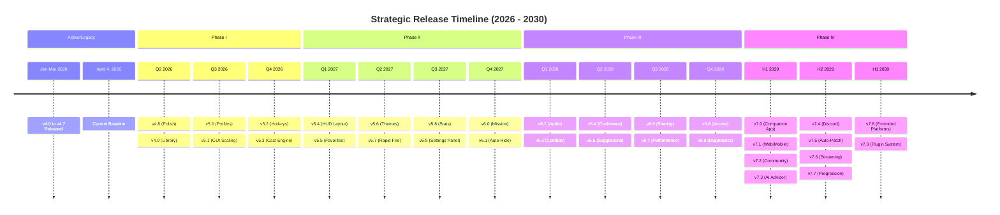

***

```markdown
# 🛡️ S.T.R.A.T.A.G.E.M. TERMINAL
**SUPER EARTH FORWARD OPERATIONS COMMAND - CLASSIFIED DOCUMENT**
> **Current Revision:** April 04, 2026 | **Status:** ACTIVE DEVELOPMENT
> **Project Code:** HellDiversMacros

---

## 📑 Table of Contents
1. [Project Timeline & Forecasting](#1-project-timeline--forecasting)
2. [Section 12: File Structure](#2-file-structure)
3.[Section 14: Legacy Version History](#3-legacy-version-history-v40---v47)
4.[Section 13: The Forward Roadmap](#4-the-forward-roadmap-v48---v79)
   -[Phase I: Polish & Profiles (Q2–Q4 2026)](#phase-i-polish--profiles-q2q4-2026)
   -[Phase II: Customization & UI (Q1–Q4 2027)](#phase-ii-customization--ui-q1q4-2027)
   - [Phase III: Awareness & Network (Q1–Q4 2028)](#phase-iii-awareness--network-q1q4-2028)
   -[Phase IV: External Ecosystem & AI (2029–2030)](#phase-iv-external-ecosystem--ai-20292030)

---

## 📅 1. Project Timeline & Forecasting



---

## 📂 2. File Structure
The core engine runs on a lightweight, modular file architecture:

```text
HellDiversMacros/
├── 📜 Helldivers.ahk          # Main execution script
├── ⚙️ stratagem_loadout.ini   # Saved loadout (auto-created on first DEPLOY)
└── 📖 README.md               # Documentation & Roadmap
```

---

## 🕰️ 3. Legacy Version History (v4.0 - v4.7)

| Version | Milestone Summary | Status |
| :--- | :--- | :---: |
| **v4.0** | Initial public release. Basic overlay with 6 configurable slots. | 🟢 |
| **v4.1** | ComboBox dropdowns replaced raw text input fields for stratagem selection. | 🟢 |
| **v4.2** | Compact click-through mode introduced; overlay passes mouse input to game. | 🟢 |
| **v4.3** | Rapid fire mode added with jittered timing for semi-auto weapon support. | 🟢 |
| **v4.4** | `MonitorGetWorkArea` DPI fix ensures correct positioning on high-DPI displays. | 🟢 |
| **v4.5** | **RAPID ON** indicator added for hidden mode. | 🟢 |
| **v4.6** | Loadout expanded to 9 slots; Slot 0 hardcoded to SOS Beacon. | 🟢 |
| **v4.7** | Stratagems refactored to object arrays (`{Name, Keys}`). DB expanded to 102 entries. GUI overhauled (420px width, colored stripes, dark ComboBox theming). | 🟢 |

---

## 🚀 4. The Forward Roadmap (v4.8 - v7.9)
*Helldiver, study this document carefully. All versions are subject to operational revision.*

### Phase I: Polish & Profiles (Q2–Q4 2026)
<details open>
<summary><b>🛠️ v4.8.x - Polish & Reliability (Estimated: May 2026)</b></summary>

- `[4.8.1]` **HUD Opacity Slider:** Real-time opacity slider (50-255).
- `[4.8.2]` **Compact Position Memory:** Remembers dragged coordinates (`CompactX`/`CompactY`).
- `[4.8.3]` **Per-Slot Hotkeys:** Inline hotkey display (e.g., Ctrl+5).
- `[4.8.4]` **Display Name Override:** Custom short labels (e.g., "Nuke").
- `[4.8.5]` **Startup Position:** 6 pre-defined docking presets.
- `[4.8.6]` **Auto-Reload Watch:** Automatic script reload on `.ahk` save.
- `[4.8.7]` **Cast Flash Animation:** Cyan pulse (4FC3F7) with 200ms fade.
- `[4.8.8]` **Config Export:** One-click clipboard copy as JSON.
- `[4.8.9]` **In-App Update Notifier:** Silent GitHub release checks.
- `[4.8.10]` **Sequence Reverse-Lookup:** Identify stratagems from directional inputs.
</details>

<details>
<summary><b>📚 v4.9.x - Stratagem Library Management (Estimated: June 2026)</b></summary>

- `[4.9.1]` **Favorites System:** Starred stratagems float to the top.
- `[4.9.2]` **Recently Used:** Top 10 stratagems cast this session.
- `[4.9.3]` **Category Filter:** Tabs for Orbital / Eagle / Support / Defense / Mission / Vehicles.
- `[4.9.4]` **Sequence Validator:** Red highlights for malformed strings.
- `[4.9.5]` **Custom Stratagem Entry:** Modal form to add custom Name/Sequence.
- `[4.9.6]` **Duplicate Sequence Detector:** Yellow warning highlights for redundancies.
- `[4.9.7]` **JSON Import:** Replace/merge the built-in 102-entry list.
- `[4.9.8]` **Stratagem Notes:** Personal tooltips per slot.
- `[4.9.9]` **Library Panel:** Modal window showing all stratagems, sortable.
- `[4.9.10]` **Export Library:** Dump database to `.txt` or `.json`.
</details>

<details>
<summary><b>🗂️ v5.0.x - Multi-Loadout Profiles (Estimated: Q3 2026)</b></summary>

- `[5.0.1]` **Profile System Foundation:** Separated `.ini` files in `/profiles`.
- `[5.0.2]` **Profile Switcher:** Dropdown UI and HUD title bar display.
- `[5.0.3]` **Profile Hotkey:** Global toggle (default: `Ctrl+Alt+P`).
- `[5.0.4]` **Mission Tags:** Tag profiles (Bugs / Bots / Illuminates / General).
- `[5.0.5]` **Import/Export:** Drag-and-drop `.ini` support.
- `[5.0.6]` **Profile Copy:** Duplicate profiles instantly.
- `[5.0.7]` **Loadout Diff:** Side-by-side slot comparison.
- `[5.0.8]` **Share Codes:** 20-char alphanumeric share strings.
- `[5.0.9]` **Profile History:** Undo button (`Ctrl+Z`) for profile switches.
- `[5.0.10]` **Startup Default:** Override active profile on launch.
</details>

<details>
<summary><b>📐 v5.1.x - GUI Scaling & Display (Estimated: Q3 2026)</b></summary>

- `[5.1.1]` **DPI-Aware Rendering:** Flawless 125%, 150%, 200% scaling.
- `[5.1.2]` **Size Presets:** Small (320px), Standard (420px), Wide (560px).
- `[5.1.3]` **Font Override:** Global text scale (6pt–14pt).
- `[5.1.4]` **Arrow Styles:** ASCII (`^v<>`), Unicode (`↑↓←→`), Roman (`U D L R`).
- `[5.1.5]` **Accent Color Picker:** Custom hex gold/cyan/red replacements.
- `[5.1.6]` **Independent Opacity:** Separate background and text alpha channels.
- `[5.1.7]` **Light Mode:** High-contrast non-tactical theme.
- `[5.1.8]` **Custom Background:** Solid RGB hex integration.
- `[5.1.9]` **Animation Toggle:** Disable flashes/pulses for low-end/photosensitive users.
- `[5.1.10]` **Multi-Monitor Pin:** Dropdown monitor selector.
</details>

<details>
<summary><b>⌨️ v5.2.x - Hotkey Remapper (Estimated: Q4 2026)</b></summary>

- `[5.2.1]` **Modifier Remapper:** Swap `Ctrl` for Alt, Shift, Win, etc.
- `[5.2.2]` **Independent Hotkeys:** Fully custom keys per slot.
- `[5.2.3]` **HUD Toggle Rebind:** Unbind default `=` and `-`.
- `[5.2.4]` **Rapid Fire Rebind:** Change default `End` key.
- `[5.2.5]` **Conflict Checker:** Real-time red highlight for duplicate bindings.
- `[5.2.6]` **Mouse Support:** Bind to M4, M5, or Scroll Wheel.
- `[5.2.7]` **Gamepad Support:** ViGEm integration for XInput controllers.
- `[5.2.8]` **Profile Hotkeys:** Unique keybinds per Loadout Profile.
- `[5.2.9]` **HUD Display:** Live view of bound keys on overlay.
- `[5.2.10]` **Import/Export Hotkeys:** Share JSON bind setups.
</details>

<details>
<summary><b>⚙️ v5.3.x - Cast Engine Enhancements (Estimated: Q4 2026)</b></summary>

- `[5.3.1]` **Global Speed Slider:** 0.5x (Fast) to 3x (Slow/Safe).
- `[5.3.2]` **Per-Stratagem Speed:** Override delays for specific complex sequences.
- `[5.3.3]` **Input Methods:** `SendInput`, `SendEvent`, `SendPlay`.
- `[5.3.4]` **Activation Key Config:** Change the `Ctrl` holding key.
- `[5.3.5]` **Buffered Queue:** Sequential queuing of multiple fast hotkey presses.
- `[5.3.6]` **Cast Abort Key:** Panic interrupt (Default: `Q`).
- `[5.3.7]` **Anti-Spam Interval:** Cooldown to prevent accidental double-casts.
- `[5.3.8]` **Dry-Run Mode:** Tooltip display of expected input string without firing.
- `[5.3.9]` **Debug Log:** Writes `cast_debug.log` with timestamps and results.
- `[5.3.10]` **Jitter Profiles:** Uniform, Gaussian, Human, Fast.
</details>

### Phase II: Customization & UI (Q1–Q4 2027)
<details>
<summary><b>Click to expand Phase II Roadmap (v5.4.x - v6.1.x)</b></summary>

*   **v5.4.x - HUD Layout Editor (Q1 2027):** Drag handles, visibility toggles, slot reordering, Snap-to-Edge, Mini Mode ticker, Click-Through configs, per-slot color coding.
*   **v5.5.x - Quick-Cast Favorites Bar (Q1 2027):** Floating 8-slot toolbar (F1-F8), drag-and-drop, usage counters, auto-hide mechanics, and independent theme profiles.
*   **v5.6.x - Theme System (Q2 2027):** Presets (Helldiver Classic, Night Ops, Automaton, Illuminate), WYSIWYG Theme Editor, Gradient accents, and Shareable URL strings for themes.
*   **v5.7.x - Rapid Fire Enhancements (Q2 2027):** Live fire-rate sliders (20-150ms), Burst Mode, Right-Click mode, Hold-to-fire toggles, Weapon preset profiles, and Audio cues.
*   **v5.8.x - Usage Statistics (Q3 2027):** Session counters, all-time `cast_history.csv`, Top-10 rankings, average speed tracking, abort detection, and data export.
*   **v5.9.x - Settings Panel (Q3 2027):** Dedicated modal window with categories, search, inline help, backup/restore, a First-Run Wizard, and cloud-sync configurations.
*   **v6.0.x - Mission Awareness (Q4 2027):** MM:SS Timers, Reinforcement tracking, Eagle charge logic, SEAF Extract countdowns, Custom objective reminders, and Booster notes.
*   **v6.1.x - Smart Auto-Hide (Q4 2027):** Cursor-lock detection, fade animations, `Ctrl+Shift` Peek mode, menu-aware un-hiding, and exe whitelisting.
</details>

### Phase III: Awareness & Network (Q1–Q4 2028)
<details>
<summary><b>Click to expand Phase III Roadmap (v6.2.x - v6.9.x)</b></summary>

*   **v6.2.x - Audio Feedback (Q1 2028):** Cast Start/Complete/Abort tones, Custom `.wav` support, TTS readouts, audio profiles, and specific output device routing.
*   **v6.3.x - Stratagem Combo System (Q1 2028):** Multi-cast chains with inter-cast delays, conditional executions, built-in templates (Opening Blitz, Support Drop), and Combo hotkeys.
*   **v6.4.x - Cooldown Tracking (Q2 2028):** Database-backed HUD timers, ready-alerts, Eagle rearm integration, custom timer overrides, and cooldown CSV logging.
*   **v6.5.x - Context-Aware Suggestions (Q2 2028):** Manual faction inputs, curated anti-bug/bot/illuminate lists, difficulty modifiers, and community-weighted vote data.
*   **v6.6.x - Loadout Sharing & Network (Q3 2028):** Base64 share codes, QR code displays, One-click Discord copy, LAN UDP party broadcasts, and Gist-backed permalinks.
*   **v6.7.x - Performance Optimization (Q3 2028):** 1Hz Sleep Mode, Lazy GUI redraws, Compiled `.exe` distribution, <15MB RAM footprint, Low-Spec Mode, and Developer performance panel.
*   **v6.8.x - Accessibility (Q4 2028):** High-Contrast/Colorblind/Large-Text modes, reduced motion, Screen Reader hints, Keyboard-only navigation, and locale standardizations.
*   **v6.9.x - Diagnostics & Support (Q4 2028):** In-app log viewer, Game Process monitor, auto-backups, Crash Recovery, Headless unit tests, and GitHub-ready Support Bundle generation.
</details>

### Phase IV: External Ecosystem & AI (2029–2030)
<details>
<summary><b>Click to expand Phase IV Roadmap (v7.0.x - v7.9.x)</b></summary>

*   **v7.0.x - Companion App Window (H1 2029):** Dedicated desktop GUI with drag-and-drop building, real-time mirror, full database browsing, and IPC (Named Pipe) syncing.
*   **v7.1.x - Web Companion & Mobile (H1 2029):** `localhost:7447` PWA server, touch-optimized phone UI, QR pairing, live push updates, and WebSocket multi-device sync.
*   **v7.2.x - Community Platform (H1 2029):** GitHub-hosted JSON registry, trending loadouts, tag subscriptions, one-click submissions, and loadout version diffing.
*   **v7.3.x - AI Stratagem Advisor (H1 2029):** Local `llama.cpp` LLM, natural language generation ("anti-tank Helldive"), synergy analysis, voice queries, and preference learning.
*   **v7.4.x - Discord Integration (H2 2029):** Rich Presence, Webhook payloads, bot command support (`!loadout`), Voice-activity muting, and Discord party chat sync.
*   **v7.5.x - Automatic Game Patching (H2 2029):** `.exe` hashing, silent GitHub DB pulls, checksum validation, rollback states, and community-verified sequence correction.
*   **v7.6.x - Streamer & Creator Tools (H2 2029):** OBS Transparent Browser source, Twitch vote-to-cast, StreamElements alerts, YouTube chapter data, and auto-subtitles.
*   **v7.7.x - Achievements & Progression (H2 2029):** 30 milestones, Mastery Ranks (Rookie -> Legend), Daily Challenges, Badge export cards, and GitHub leaderboards.
*   **v7.8.x - Extended Platform Support (H1 2030):** Linux/Wine guides, Steam Deck mode, Windows 11 Mica/DWM styling, 5 localized languages, and fully compiled 64-bit releases.
*   **v7.9.x - Plugin & Extension System (H1 2030):** Full AHK v2 API hooks, Permission sandboxing, in-app plugin marketplace, Wiki/YouTube integrators, and SDK distribution.
</details>

---
*For Democracy, Liberty, and highly optimized keystrokes.*
```
